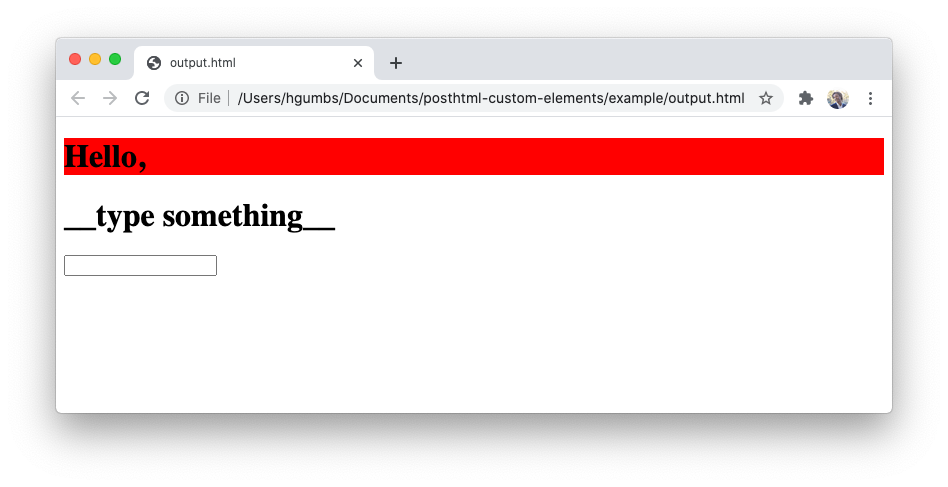

Running [`node posthtml.js`](./posthtml.js) builds [`index.html`](./index.html) and outputs a messier version of the following HTML:

```html
<!DOCTYPE html>
<body>
  <hello-world></hello-world>

  <template data-component="hello-world">
    <style>
      h1 { background-color: red }
    </style>

    <h1>Hello,</h1>
    <greet-by-name></greet-by-name>
  </template>

  <template data-component="greet-by-name">
    <h1 id="out"></h1>
    <input id="in" autofocus="">
  </template>

  <script>
    customElements.define('hello-world', class extends HTMLElement {
      connectedCallback() {
        this.attachShadow({ mode: 'open' }).appendChild(document.querySelector('[data-component="hello-world"]').content.cloneNode(true));
      }
    });
    customElements.define('greet-by-name', class extends HTMLElement {
      connectedCallback() {
        this.attachShadow({ mode: 'open' }).appendChild(document.querySelector('[data-component="greet-by-name"]').content.cloneNode(true));

        const root = this.shadowRoot || document;
        const in_ = root.getElementById('in');
        const out = root.getElementById('out');
        const listener = () => out.innerText = in_.value || '__type something__';
        listener();
        in_.addEventListener('input', listener);
      }
    });
  </script>
</body>
```
